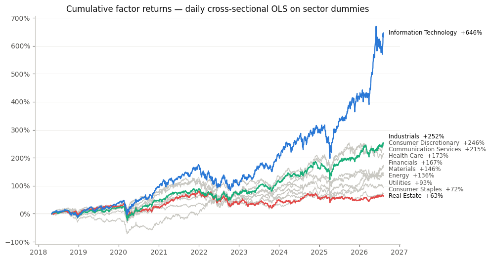
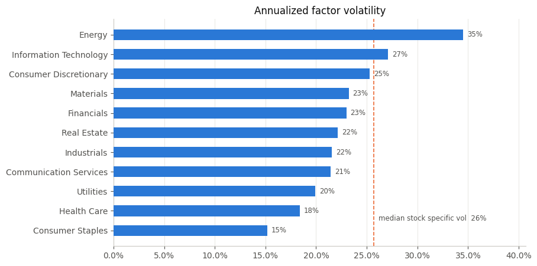
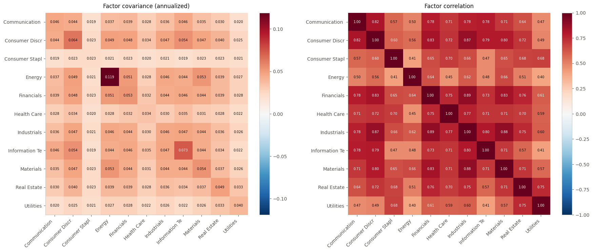
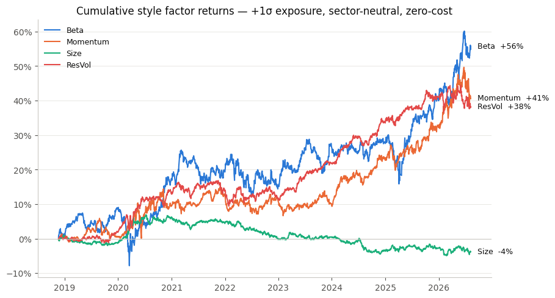
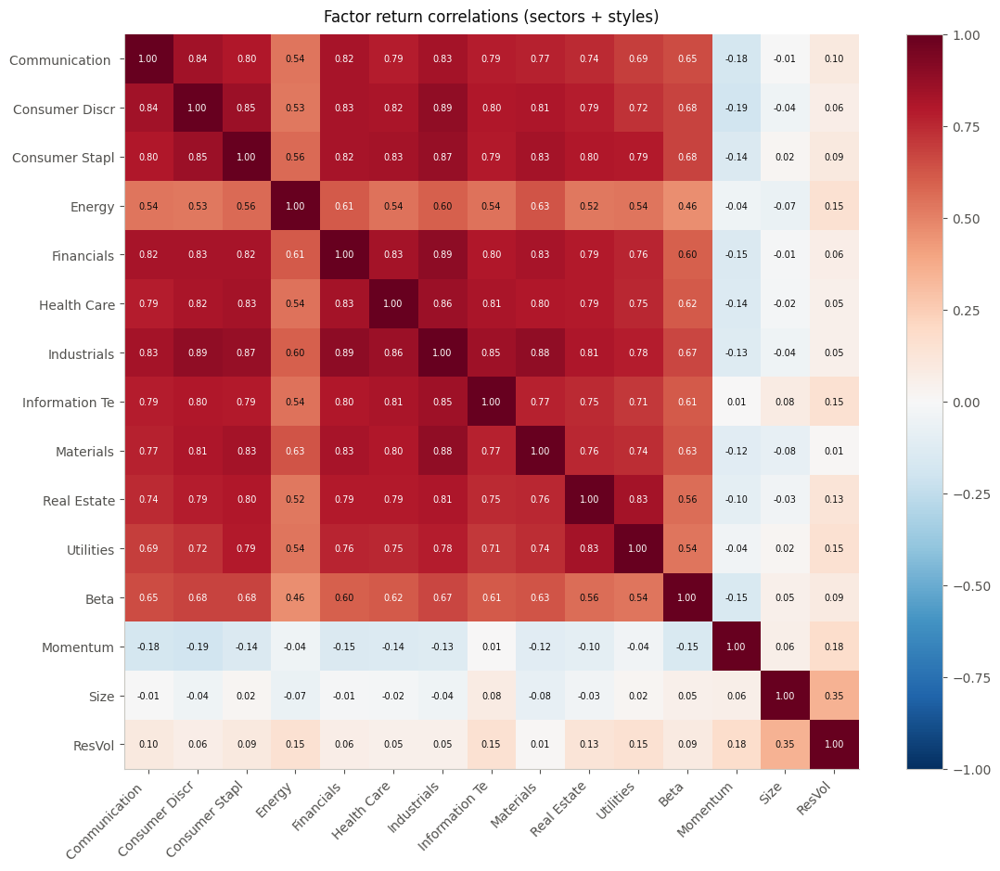
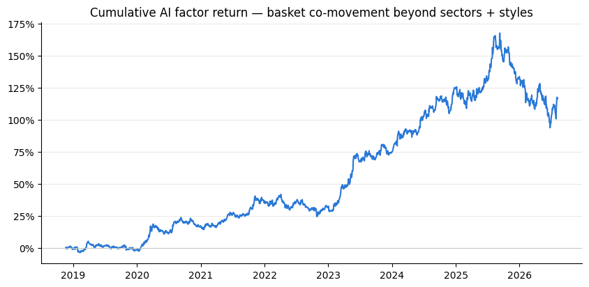

# Factor Risk Model

A Barra-style multi-factor equity risk model for the S&P 500, built from eight years of
daily OHLCV data. It explains stock returns with **11 GICS sector factors** and **4 style
factors** (Beta, Momentum, Size, ResVol), estimates covariance with USE4-style **EWMA
half-lives**, and saves to plain CSV/JSON so any portfolio can be analyzed in
milliseconds — including bolting on **custom thematic factors** (e.g. an "AI" factor)
without refitting.

```python
from risk_model import RiskModel

m = RiskModel.load('model')
m.report({'AAPL': 0.4, 'XOM': 0.3, 'JPM': 0.3})
m.add_factor('AI', ['NVDA', 'MSFT', 'AVGO', 'AMD'])
```

---

## Why factor models exist

A portfolio's risk is `w' Σ w`, where Σ is the covariance of all stock returns. Estimating
Σ directly is hopeless: 503 stocks means **126,756 pairwise covariances** estimated from
~2,000 daily observations — mostly noise, and unusable for optimization. A factor model
compresses the problem: stocks co-move because they share a small number of common
drivers, so model each stock's return as its exposures to K factors plus a leftover all
its own:

$$r_t = X_t f_t + \varepsilon_t \qquad\Rightarrow\qquad \Sigma = B\,F\,B^\top + D$$

| Piece | Shape | Meaning |
|---|---|---|
| $B$ | N×15 | each stock's factor **exposures** (which sector it's in, how high-beta it is, …) |
| $F$ | 15×15 | covariance of the **factor returns** — the only dense object left to estimate |
| $D$ | N×N diagonal | each stock's **specific variance** — risk no factor explains |

Instead of 127k noisy parameters, you estimate ~120 factor covariances and 503 specific
variances. The payoff goes beyond stability: risk becomes **explainable** ("your book is
24% vol, and 23 points of that is the Information Technology factor"), hedgeable, and
attributable.

## The data

Daily OHLCV bars from Databento (XNAS ITCH), May 2018 → Aug 2026: 18.9M rows across
~23,600 symbols, filtered to the 503 current S&P 500 members with a GICS sector mapping
(`sp500.csv`). Returns are simple daily returns from unadjusted closes with no forward
filling; |return| > 50% prints (bad data, raw split jumps) are masked to NaN.

## Layer 1 — sector factors (`factor_risk_model.ipynb`)

The simplest exposures possible: eleven 0/1 dummies, one per GICS sector. Each day, the
model runs one cross-sectional OLS of that day's stock returns on the dummies,
$\hat f_t = (X_t^\top X_t)^{-1} X_t^\top r_t$, using only the names that traded. Because
the dummies are disjoint, this regression provably collapses to **each sector's
equal-weighted mean return** — so a single `groupby` runs all ~2,000 daily regressions
and handles missing names for free. Each factor's return series is a real, investable
thing: the daily P&L of holding that sector's names equally.



Sector factors alone explain a mean cross-sectional R² of **0.29** — a third of a typical
day's return dispersion is just "which sector are you in."

A key empirical fact falls out immediately: single-stock risk is mostly **specific** (the
median stock's residual vol, dashed line, beats every sector factor's vol), which is why
diversification works — and why portfolio risk is dominated by factors instead:



The factor covariance/correlation structure shows the market factor hiding inside the
sector means — every sector correlates 0.4–0.9 with every other:



## Layer 2 — style factors (`style_factors.ipynb`)

Stocks also co-move in ways that cut **across** sectors: high-beta names rally together,
winners keep winning, small illiquid names trade alike. Styles capture this with
continuous exposures in the spirit of Barra USE4, each built with Barra's own half-life
weighting:

| Style | Barra analog | Construction |
|---|---|---|
| **Beta** | BETA | EWMA regression vs the equal-weighted market, half-life 63d |
| **Momentum** | RSTR | EWMA-weighted return, half-life 126d, skipping the last month (reversal lives there) |
| **Size** | SIZE / LIQUIDTY | log 63d median dollar volume — a split-robust proxy; true size needs shares outstanding |
| **ResVol** | DASTD | EWMA std of the *sector-model* residuals, half-life 42d |

Every exposure is winsorized at ±3σ, z-scored across the universe daily (mean 0, std 1),
and **lagged one day** so day *t*'s return is only explained by information through
*t−1*. With continuous exposures the `groupby` shortcut dies, so each day is an explicit
15-coefficient least-squares fit. Mean cross-sectional R² rises from 0.29 to **0.38**.

Because exposures are standardized z-scores, each style factor return is the P&L of a
**zero-cost, sector-neutral portfolio with +1σ of that style** — momentum is literally
"winners minus losers, sector-neutralized":



The full 15×15 correlation matrix confirms the styles earn their place: they are nearly
orthogonal to the sector block (Beta's ~0.6 correlation with sectors is real economics —
high-beta names co-move with the market — not redundancy):



## Layer 3 — covariance the Barra way (half-lives)

A flat sample covariance weights 2018 and last week equally. Barra instead makes every
moment an EWMA — an observation aged τ days gets weight (1/2)^(τ/HL) — with a
**different memory for different quantities**, plus a Newey-West (Bartlett) adjustment
for serial correlation:

| Quantity | Half-life | Newey-West lags |
|---|---|---|
| factor **variances** | 84d | 5 |
| factor **correlations** | 504d | 2 |
| **specific** variances | 84d | 5 |

Short vol memory makes risk track the current regime; long correlation memory keeps the
structure stable. Variances and correlations are estimated separately, recombined, and
repaired to positive semi-definite. The effect is large: flat 8-year factor vols run
20–31% (they average over COVID and 2022), the EWMA vols run 13–21%, and the equal-weight
portfolio's predicted vol drops from **19.9% to 13.5%** — the difference between
measuring today's regime and averaging over history.

---

## Using the model

`style_factors.ipynb` fits everything and saves it to `model/` as plain CSV + JSON
(version-proof, unlike pickles). From there, no raw data is ever touched again —
`portfolio_analysis.ipynb` is the worked demo of everything below.

### Instant portfolio risk

Weights are fractions of NAV; shorts and net ≠ 1 are fine; unknown tickers are warned
about and ignored. Actual output for a 5-name mega-cap tech book:

```text
>>> m.report({'AAPL': .2, 'MSFT': .2, 'NVDA': .2, 'GOOGL': .2, 'AMZN': .2})

net +1.00  gross 1.00   (model fit: 2026-08-07)
total vol    :  23.89%
  factor     :  19.81%   (68.8% of variance)
  specific   :  13.35%   (31.2% of variance)
style exposures (z-units): Beta -0.14  Momentum +0.30  Size +3.07  ResVol +0.33

top factor variance contributors:
Information Technology    0.316
Size                      0.229
Communication Services    0.065
```

The model reads the book correctly with no help: five names isn't diversified (31% of
variance still specific), and the +3.1σ Size exposure flags that these are the largest
names in the universe.

### Custom thematic factors

Any basket of stocks can become a factor — without refitting. The naive approach
(average return of AI stocks) would mostly re-measure "these are tech stocks," so
`add_factor` instead defines the factor's daily return as the basket's equal-weighted
**residual** return: the co-movement that sectors and styles do *not* already explain.
Exposures gain a 0/1 basket column, the factor covariance grows a row estimated from
history, and basket names' specific risk drops by what the factor absorbs.

```python
m.add_factor('AI', ['NVDA', 'MSFT', 'GOOGL', 'META', 'AMZN',
                    'AVGO', 'AMD', 'ORCL', 'ANET', 'PLTR'])
# added factor 'AI': 10 names, annualized vol 11.3%,
# max |corr| with existing factors 0.24
```

The result is a genuinely new risk source — 11.3% annualized vol, ≤0.24 correlation with
all 15 existing factors — and its history is the AI era drawn in one line: flat through
2019, relentless from 2023, +150% peak in late 2025:



An AI-tilted book then shows "AI" as an explicit line in its risk decomposition (16% of
variance for a book with 50% of NAV in basket names), and custom factors compose — a
second `add_factor` correctly accounts for its correlation with the first.

### Half-life control

The stored history rides along in the artifacts, so the covariance can be re-estimated
at whim — shorter half-lives for a risk number that reacts to the current regime, longer
for a steadier one. Custom factors survive the refit.

```python
m.refit_covariance(vol_half_life=21)   # tech book: 29.4% -> 32.5% (recent vol is hot)
m.refit_covariance()                   # back to USE4 defaults
```

### Zero-shot factor forecasting with TimesFM 3

The saved factor-return matrix is also a natural multivariate time series: the 11 sector
returns and 4 style returns co-evolve each day. `timesfm_forecast.py` sends those series
to [Google TimesFM 3](https://github.com/google-research/timesfm) as **joint targets** in
one zero-shot query. This uses the model's cross-variate attention instead of forecasting
each factor independently. The result contains a point path and the nine marginal
quantiles (0.1–0.9) for every factor.

TimesFM is an additional forecasting layer, not a replacement for the risk model:

- `factor_cov.csv` remains the estimate of current factor risk and correlation.
- TimesFM forecasts conditional factor-return paths from `factor_returns.csv`.
- A portfolio point forecast is $b^\top \hat f_t$, using the portfolio's current factor
  exposures. Marginal factor quantiles are deliberately **not** added together because
  that would not produce a valid portfolio quantile.
- The rolling backtest compares TimesFM with a zero-return forecast. Daily financial
  returns are hard to predict, so downstream use should depend on out-of-sample skill,
  not on the fact that a foundation model produces plausible-looking output.

Install the optional dependency in a clean environment (Python 3.11 or 3.12 is the
most conservative choice for the PyTorch stack):

```powershell
# Windows PowerShell
py -3.11 -m venv .venv
.venv\Scripts\Activate.ps1
python -m pip install --upgrade pip
pip install -r requirements-timesfm-cuda.txt  # NVIDIA GPU
# Use requirements-timesfm.txt instead for CPU-only execution.
```

Then run a 20-day joint forecast:

```bash
python BinaryClassification/forecast_factors.py \
  --model-dir BinaryClassification/model \
  --output-dir BinaryClassification/timesfm_output \
  --horizon 20 --context-length 512 --device cuda \
  --backtest-windows 6
```

The first run downloads the `google/timesfm-3.0-pytorch` checkpoint. Omit `--device` to
let PyTorch choose CUDA when available and CPU otherwise. Verify a GPU installation with
`python -c "import torch; print(torch.__version__, torch.cuda.is_available())"`; the
version should include `+cu132` and availability should be `True`. Output includes factor point
and quantile CSVs, metadata, and (when requested) rolling backtest metrics. Forecast rows
are numbered steps at the same frequency as the input. The forecast origin is the last
row in `factor_returns.csv` (currently 2026-08-07 in the checked-in artifact), so refresh
and refit the model before treating the output as current.

To project the point path onto a portfolio, save weights such as
`{"AAPL": 0.4, "XOM": 0.3, "JPM": 0.3}` to a JSON file and add
`--portfolio-json weights.json`. To use TimesFM 3's covariate support, pass CSVs with
time on rows and covariates on columns:

- `--past-only-covariates`: values known only through the forecast origin, such as
  realized VIX, volume, rates, or macro surprises; must cover the context window.
- `--past-future-covariates`: values known through the entire horizon, such as an
  earnings calendar, scheduled FOMC/CPI events, month-end flags, or pre-announced index
  rebalances; must cover context + horizon. Do not put future-realized market data here.

Covariate CSV rows are consumed positionally after taking the required trailing window;
make sure their observation order exactly matches the factor-return rows and then the
forecast steps.

TimesFM 3 accepts at most 32 channels in a joint forward pass. With this project's 15
default target factors, up to 17 covariate channels can be supplied; select a factor
subset with `--factors` if more covariates are needed.

Python callers can reuse one loaded checkpoint across forecasts:

```python
from risk_model import RiskModel
from timesfm_forecast import TimesFMFactorForecaster

m = RiskModel.load('BinaryClassification/model')
tfm = TimesFMFactorForecaster(m, device='cuda')
forecast, portfolio = tfm.forecast_portfolio(
    {'AAPL': 0.4, 'XOM': 0.3, 'JPM': 0.3},
    horizon=20,
    context_length=512,
)
print(portfolio.cumulative_return.iloc[-1])
print(tfm.backtest(horizon=20, windows=6).loc['__overall__'])
```

> **License:** the TimesFM source package is Apache-2.0, but Google's current TimesFM 3
> pretrained weights use the separate TimesFM Non-Commercial License v1.0. They are
> restricted to non-commercial, non-production use. This repository does not redistribute
> the checkpoint. Obtain different weights or terms before any commercial/production use.

### Direct access

- `m.exposures(w)` — the portfolio's 15+ factor exposures
- `m.decompose(w)` — the full decomposition as a dict, for further computation
- `m.covariance([...])` — model-implied asset covariance block for any symbols
- `m.factor_returns` — daily factor return history, for attribution and plots
- `m.save(path)` — persist an augmented model; `RiskModel.load(path)` round-trips it

---

## Repository layout

| Path | What it is |
|---|---|
| `BinaryClassification/factor_risk_model.ipynb` | Layer 1: the sector-dummy model, derived from scratch. Start here. |
| `BinaryClassification/style_factors.ipynb` | Layers 2–3: styles, half-life covariance; fits and **saves the model**. |
| `BinaryClassification/portfolio_analysis.ipynb` | The capabilities demo: reports, the AI factor, half-life control. |
| `BinaryClassification/risk_model.py` | The library: save/load, portfolio analytics, EWMA/Newey-West estimators, custom factors. |
| `BinaryClassification/timesfm_forecast.py` | TimesFM 3 adapter: joint factor forecasts, marginal quantiles, portfolio projection, rolling backtest. |
| `BinaryClassification/forecast_factors.py` | CLI for factor/covariate/portfolio forecasts and CSV output. |
| `BinaryClassification/model/` | Saved model artifacts (below). |
| `BinaryClassification/sp500.csv` | Symbol → GICS sector map (current S&P 500 membership). |
| `OLSReg/` | First pass: time-series OLS of single stocks on sector ETF returns; `getData.ipynb` documents building `8YearsData.pkl` from the raw Databento files. |
| `docs/img/` | Figures exported from the executed notebooks (used in this README). |
| `8YearsData.pkl`, `XNAS-*/`, `filtered_data.pkl` | Data (gitignored). |

### Model artifacts (`model/`)

| File | Contents |
|---|---|
| `exposures.csv` | N×15 latest per-name exposures |
| `factor_cov.csv` | 15×15 annualized factor covariance (EWMA + Newey-West) |
| `specific_var.csv` | per-name annualized specific variance |
| `sectors.csv` | symbol → sector |
| `factor_returns.csv` | daily factor return history |
| `residual_returns.csv.gz` | daily specific returns — what enables custom factors and refits |
| `meta.json` | fit date/window, R², half-life settings, custom-factor registry |

`model_ai/` (when present) is generated output from the demo notebook.

## Quickstart

```bash
python3 -m venv .venv && source .venv/bin/activate
pip install numpy pandas matplotlib jupyter        # + databento, to rebuild the pickle
```

Place `8YearsData.pkl` at the repo root (or rebuild it from the raw Databento directory —
see `OLSReg/getData.ipynb`), run `style_factors.ipynb` top to bottom to fit and save,
then use `portfolio_analysis.ipynb` or three lines of `risk_model.py` anywhere.

## Known limitations

- **Survivorship bias** — the universe is *today's* S&P 500 membership applied through
  history; dead and removed names are absent, so factor returns are somewhat rosy.
- **Size is a proxy** (dollar volume). True SIZE needs shares outstanding; Value,
  Earnings Yield, Growth, and Leverage need point-in-time fundamentals the OHLCV data
  can't provide.
- Returns come from unadjusted closes: split-day jumps are masked out, dividends excluded.
- Custom factors use static basket membership and an approximate bolt-on; the exact
  treatment is refitting the daily regressions with the basket dummy included.
- USE4 layers not implemented: eigenfactor risk adjustment, volatility regime adjustment.
- Saved exposures are a snapshot of the fit date — re-run `style_factors.ipynb` after
  refreshing data.
- TimesFM 3 is a general zero-shot forecaster, not a finance-specific alpha model. Its
  factor-return forecasts need rolling out-of-sample validation and are not trading advice.
- Portfolio projection holds today's exposures fixed through the horizon and covers factor
  returns only; it does not forecast future exposure changes or stock-specific returns.

## Where to take it next

True market-cap SIZE via shares outstanding, fundamentals-based Value/Quality factors,
√(cap)-weighted WLS in the daily regressions, an estimation universe with historical
index membership, and forecast calibration (bias statistics, the volatility regime
adjustment). Each drops into one cell of `style_factors.ipynb` or one method of
`risk_model.py`.
